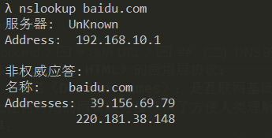
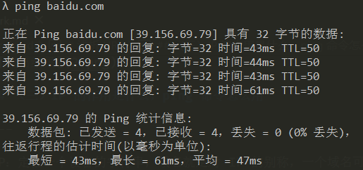

# 浅析 URL

## （一）URL 包含哪几部分，每部分分别有什么作用

---

1. 英文：A Uniform Resource Locator；
2. 原理：统一资源定位服务；
3. 含义：
   协议+域名或 IP+端口号+路径+查询字符串+锚点
4. 协议（Protocol）：超文本传输 ​​ 协议（HTTP）是一个用于传输超媒体文档（例如 HTML）的应用层协议；
5. 域名（Domain names）：是互联网基础架构的关键部分。它们为互联网上任何可用的网页服务器提供了方便人类理解的地址，用来表示 ip 对应字符串；
6. IP（Internet Protocol）：定位设备的字符串；
7. 端口号（port）：一台机器可以提供很多服务，每一个服务一个号码，这个号码就叫做端口号；
8. 路径：字符串；
9. 查询字符串：看什么内容；
10. 锚点：哪部分，文档内部的定位；

## （二）DNS 的作用是什么，nslookup 命令怎么用

---

- DNS（Domain Name System）:是一个层次化、分散化的 Internet 连接资源命名系统
- 作用：将易于记忆的域名翻译成为数字化的 IP 地址
- 操作：

```
nslookup baidu.com
```



## （三）IP 的作用是什么，ping 命令怎么用

---

IP：定位一个设备的字符串，域名就是对 IP 的别称，一个域名可以对应多个不同的 IP，这个叫做均衡负载，防止一台机器因为太多的访问而导致崩溃。一个 IP 对应不同的域名（共用服务器，或者不同网页，所以会出现不同域名情况），这个叫做共享主机。

ping 命令使用：

```
ping baidu.com
```



## （四）域名是什么，分别哪几类域名

---

域名（Domain names）是互联网基础架构的关键部分。它们为互联网上任何可用的网页服务器提供了方便人类理解的地址

域名层次：

1. 顶级域名：是域名中最高的一级，每个域名都以顶级域名结尾。顶级域名分为两类：国家及地区双字代码顶级域（国家和地区顶级域）和通用顶级域。

   前者基于 ISO-3166 规定的国家/地区双字缩写代码；后者代表了一组名称和多个组织，包括 .gov（政府），.edu（教育机构），.com（商业，现在成为全球注册量最大、最通用的域名），.mil（军事），.org（非营利组织），.net（网络，当时被定位为网络基础服务提供商）和.int（国际组织）等

2) 子域名（二级域名）:子域名将顶级域名进一步细分。域名层次结构中，顶级域名下面是二级域名，它位于顶级域名的左侧;二级域名下面是三级域名，它位于二级域名的左侧。

   For example:xiedaimala.com 是二级域名，俗称一级域名；www.xiedaimala.com 是三级域名，俗称二级。

   上述二者属于父子关系。

> 引用：https://zh.wikipedia.org/wiki/域名
